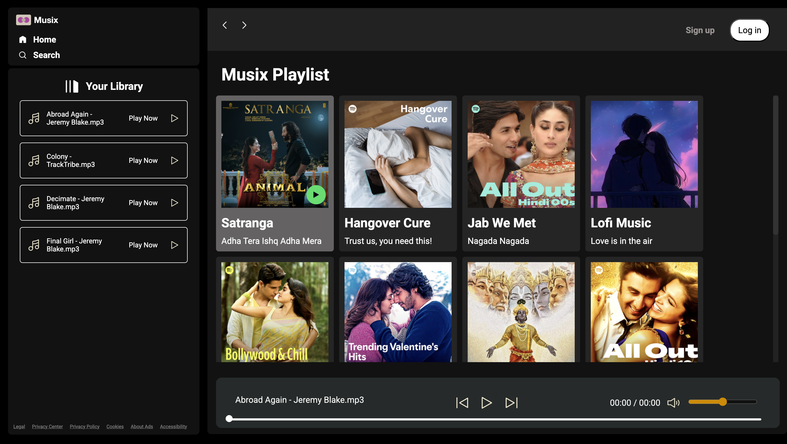

# Spotify Clone 🎵

A front-end clone of the Spotify web player, built using pure HTML, CSS, and JavaScript. This project dynamically loads and plays music from local folders, mimicking the core user experience of Spotify's interface.



---

## ✨ Features

* **Dynamic Music Loading**: Automatically scans and displays albums/playlists from the `/songs/` directory.
* **Album Metadata**: Each album uses a `info.json` file to display its title and description.
* **Complete Music Controls**: Full playback functionality including play, pause, next, and previous tracks.
* **Interactive Seekbar**: Clickable progress bar to jump to any part of the song.
* **Volume Control**: Adjust the volume with a slider, including a one-click mute/unmute toggle.
* **Responsive Design**: A mobile-friendly layout with a hamburger menu for seamless navigation on smaller screens.
* **Playlist Display**: The left panel dynamically lists all songs within a selected album.

---

## 🛠️ Tech Stack

* **HTML5**: For the basic structure and content of the web page.
* **CSS3**: For styling the user interface, including Flexbox for layout and custom properties for theming.
* **Vanilla JavaScript**: To handle all the logic, including fetching songs, audio playback, and DOM manipulation.

---

## 📂 Project Structure

The project is organized into a clear and maintainable folder structure:
```spotify-clone/
├── css/
│   ├── style.css       # Main styles
│   └── utility.css     # Utility classes
├── img/                # UI icons and assets (logo, play/pause buttons, etc.)
├── js/
│   └── script.js       # All JavaScript logic
├── songs/
│   ├── [Album-Name-1]/
│   │   ├── cover.jpg   # Album cover image
│   │   ├── info.json   # Album metadata (title, description)
│   │   └── song1.mp3   # Music files
│   └── [Album-Name-2]/
│       ├── ...
├── index.html          # The main HTML file
└── README.md
```
---

## 🚀 How to Run Locally

Because this project uses the `fetch` API to load local files, you need to run it on a local server to avoid CORS (Cross-Origin Resource Sharing) errors.

1.  **Clone the repository:**
    ```bash
    git clone [https://github.com/ashishxdev/spotify-clone.git]
    ```

2.  **Navigate to the project directory:**
    ```bash
    cd spotify-clone
    ```

3.  **Start a local server.** A simple way is to use the **Live Server** extension in VS Code.
    * Right-click on the `index.html` file.
    * Select "Open with Live Server".

4.  **Update the Fetch URL (if necessary):**
    * In `js/script.js`, the `fetch` calls are hardcoded with a specific address (e.g., `http://127.0.0.1:3000/`).
    * You may need to update this URL to match the address provided by your local server (e.g., `http://127.0.0.1:5500/`).

    ```javascript
    // In js/script.js
    
    // Find these lines and update the base URL if your server runs on a different port
    async function getSongs(folder) {
        ...
        let a = await fetch(`http://127.0.0.1:5500/${folder}/`) // UPDATE THIS
        ...
    }

    async function displayAlbums(){
        let a = await fetch(`http://127.0.0.1:5500/songs/`) // AND UPDATE THIS
        ...
    }
    ```

5.  **Open your browser** and navigate to the local server address to see the app in action!
---
